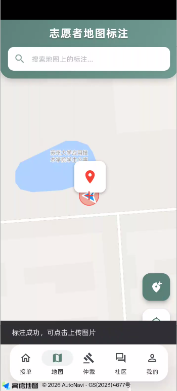
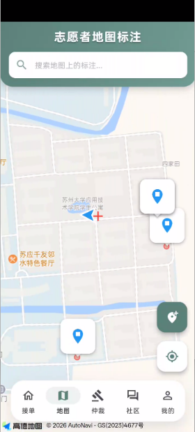
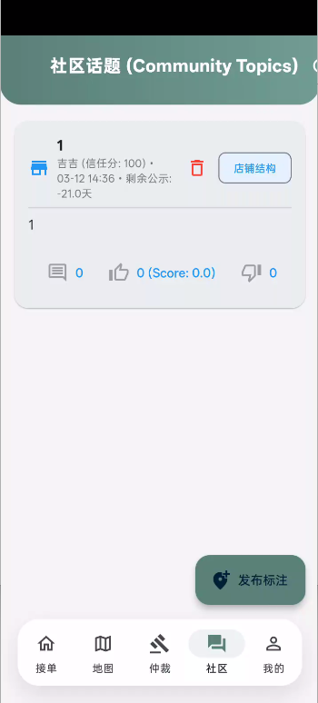
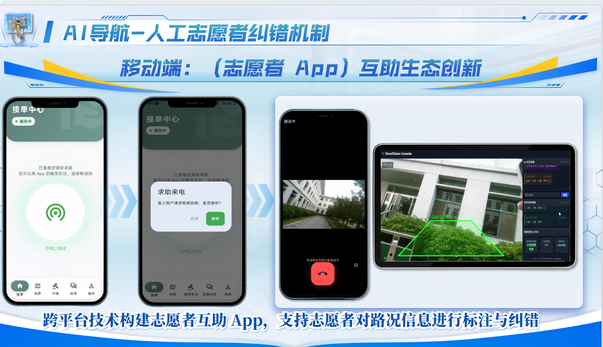
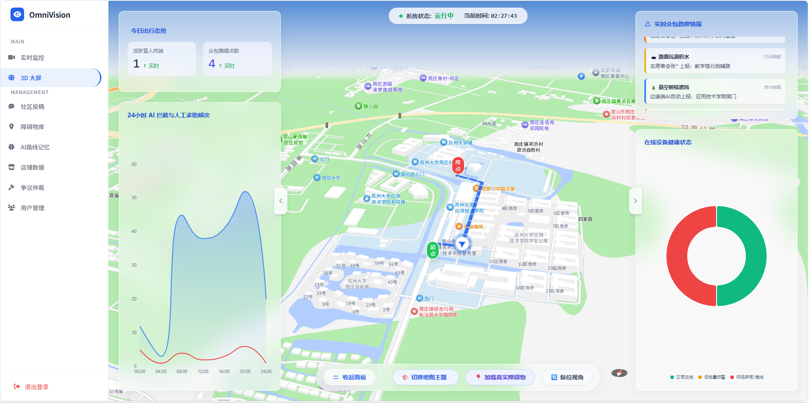
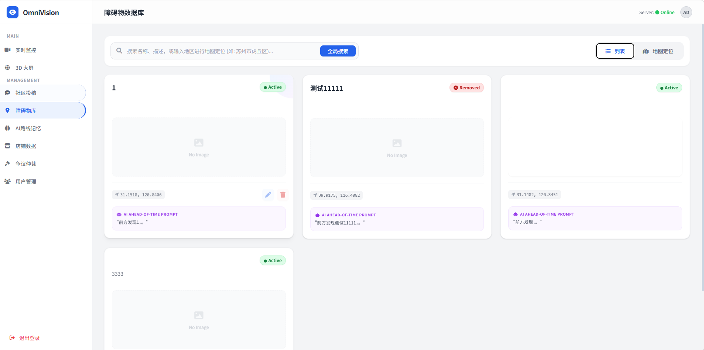
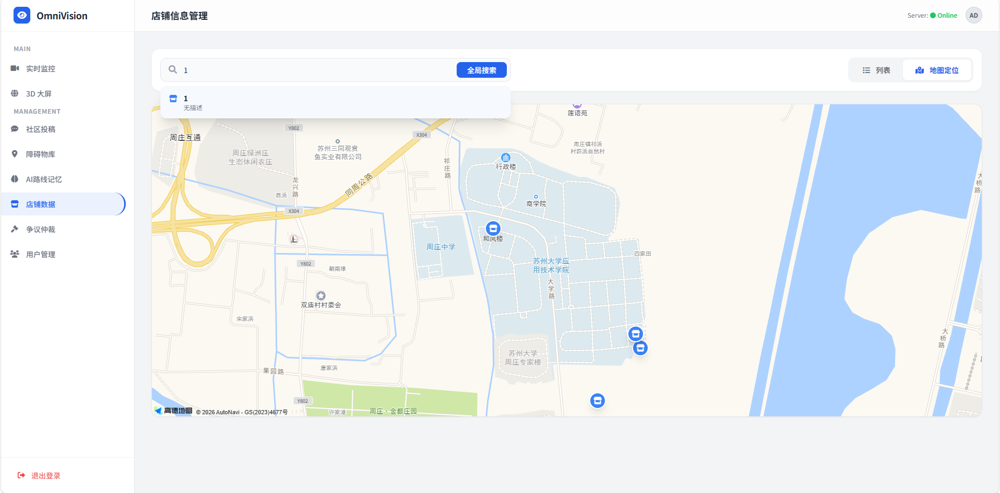

# OmniVision / 视桥智导

> CN: 面向视障辅助场景的端云协同导盲系统  
> EN: An edge-cloud collaborative assistive navigation system for visually impaired users

本仓库是面向 GitHub 交付整理后的标准化多端项目仓库，统一收纳云端服务、盲人端客户端、志愿者端 App 三个端的核心代码，并补充共享配置模板、部署脚本、API 参考与交接文档，目标是让新的开发者能够在不了解项目历史的前提下快速接手。

This repository is a standardized multi-end delivery repository for GitHub. It contains the cloud server, blind client, and volunteer mobile app, together with shared configuration templates, deployment scripts, API references, and handover documents so that a new developer can take over the project quickly.

## 中文说明

### 1. 项目简介
视桥智导是一套面向视障人群的端云协同导盲系统。系统以“边缘端保生存、云端补认知”为核心架构：

- 盲人端部署在 Raspberry Pi 5，负责本地视觉检测、ROI 风险判断、离线安全播报与流式语音采集。
- 云端服务承载导航、场景描述、多模态审核、大屏监控与 WebSocket / WebRTC 协同逻辑。
- 志愿者端采用 Flutter 开发，负责人工求助接入、地图查看、社区标注与争议审核。
- 整体设计遵循“高风险低延迟走边缘端，复杂理解与辅助决策走云端”的原则。

### 2. 仓库结构
```text
OmniVision/
├── apps/
│   ├── cloud-server/        # 云端服务端（FastAPI + Socket.IO + 静态大屏）
│   ├── blind-client/        # 盲人端（Python + 视觉/语音/硬件接入）
│   └── volunteer-app/       # 志愿者端（Flutter）
├── deploy/                  # 一键部署脚本与部署说明
├── docs/                    # API、硬件、搭建、交接文档
├── shared/
│   ├── config/              # 三端共享配置模板
│   └── scripts/             # 可复用脚本预留目录
├── docker-compose.yml       # 云端容器化编排入口
├── LICENSE                  # MIT 许可证
└── README.md
```

### 3. 三端职责
#### 云端服务 `apps/cloud-server`
- 提供 FastAPI 业务接口、场景描述、导航意图识别、后台管理大屏与监控页面。
- 提供 Socket.IO 信令服务，支撑盲人端与志愿者端的音视频协同。
- 提供静态页面 `admin_login.html`、`admin_dashboard.html`、`monitor.html`、`amap_nav.html`。

#### 盲人端 `apps/blind-client`
- 负责摄像头视频采集、边缘检测推理、红绿灯、斑马线和障碍物识别。
- 负责本地安全语音播报、流式 ASR、语音唤醒与大模型回复中断控制。
- 附带树莓派自启动 `systemd` 模板与本地运行脚本。

#### 志愿者端 `apps/volunteer-app`
- 基于 Flutter 实现登录、呼叫接单、地图查看、社区发帖、评论与争议审核。
- 支持 Android、iOS、Web、Windows、Linux、macOS 多平台构建。

### 4. 硬件概览
#### 核心硬件
- 主控板：Raspberry Pi 5
- 摄像头：MIPI-CSI 摄像头（项目硬件资料中以 IMX219 模块为代表）
- 定位模块：GNSS / GPS 模块（项目硬件资料中以 LC76G 类模块为代表）
- 语音输入：麦克风或麦克风阵列
- 语音输出：扬声器、耳机或骨传导设备
- 云端：Linux 服务器或支持 Docker 的云主机

#### 选型说明
- 选择 Raspberry Pi 5 是为了在边缘端部署检测模型，保证断网时仍可工作。
- 选择 MIPI-CSI 摄像头而不是 USB 摄像头，是为了降低传输延迟和 CPU 额外开销。
- 将危险提示保留在端侧，是为了避免云端延迟或大模型幻觉影响安全。

#### 深入文档
- 硬件与接线说明：`docs/HARDWARE_SETUP.md`
- 全系统从 0 搭建：`docs/SYSTEM_SETUP_GUIDE.md`
- 项目交接说明：`docs/PROJECT_HANDOVER.md`
- API 参考：`docs/API_REFERENCE.md`

### 5. 界面展示 / Screenshots
#### 志愿者端 App
<p align="center">
  
  
  
</p>

<p align="center">
  
</p>

- `mobile-01`：地图与任务主界面
- `mobile-02`：接单与协作流程界面
- `mobile-03`：社区与管理功能界面
- `mobile-call-showcase`：视频通话与人工协助纠错展示

#### 云端管理后台
<p align="center">
  
  
  
</p>

- `cloud-01`：实时监控或地图总览页面
- `cloud-02`：后台管理与数据配置页面
- `cloud-03`：审核与业务处理页面

### 6. 快速接手路径
1. 阅读 `docs/PROJECT_HANDOVER.md` 了解整体交接信息。
2. 阅读 `docs/HARDWARE_SETUP.md` 和 `docs/SYSTEM_SETUP_GUIDE.md`，明确硬件接线与搭建顺序。
3. 根据 `shared/config/*.example` 复制并填写本地环境变量。
4. 先启动云端，再连接盲人端，最后运行志愿者端。
5. 用 `deploy/DEPLOYMENT.md` 中的验证步骤确认三端连通。

### 7. 本地启动
#### 云端服务
```bash
cd apps/cloud-server
python -m venv .venv
source .venv/bin/activate  # Windows 使用 .venv\Scripts\activate
pip install -r requirements.txt
cp ../../shared/config/cloud.env.example ../../shared/config/cloud.env
uvicorn backend:app --host 0.0.0.0 --port 8000
```

另开终端启动信令服务：

```bash
cd apps/cloud-server
python signaling_server.py
```

#### 盲人端
```bash
cd apps/blind-client
python -m venv .venv
source .venv/bin/activate  # Windows 使用 .venv\Scripts\activate
pip install -r requirements.txt
cp .env.asr.example .env.asr
python blind_client_pi5_csi.py
```

#### 志愿者端
```bash
cd apps/volunteer-app
flutter pub get
flutter run
```

### 8. 配置与部署
- 云端配置模板：`shared/config/cloud.env.example`
- 盲人端配置模板：`shared/config/blind-client.env.example`
- 志愿者端配置模板：`shared/config/volunteer-app.env.example`
- Windows 一键部署：`./deploy/deploy-all.ps1`
- Linux 一键部署：`bash ./deploy/deploy-all.sh`

### 9. 许可证
本仓库附带 MIT 许可证，见根目录 `LICENSE` 文件。

## English

### 1. Overview
OmniVision is an edge-cloud collaborative assistive navigation system for visually impaired users.

- The blind client runs on Raspberry Pi 5 and handles on-device perception, ROI-based safety logic, offline voice prompts, and streaming voice capture.
- The cloud server is responsible for navigation, scene description, multimodal review, dashboard monitoring, and WebSocket / WebRTC collaboration.
- The volunteer app is built with Flutter and supports manual assistance, maps, community contributions, and dispute review.
- The overall architecture follows the principle of keeping life-critical low-latency logic on the edge and higher-level understanding in the cloud.

### 2. Repository Layout
```text
OmniVision/
├── apps/
│   ├── cloud-server/
│   ├── blind-client/
│   └── volunteer-app/
├── deploy/
├── docs/
├── shared/
├── docker-compose.yml
├── LICENSE
└── README.md
```

### 3. Responsibilities by Component
#### Cloud Server
- Provides FastAPI APIs, navigation processing, scene description, dashboards, and monitoring pages.
- Provides Socket.IO signaling for volunteer collaboration and WebRTC communication.

#### Blind Client
- Handles video capture, on-device inference, local safety prompts, ASR / TTS integration, and device-side control flow.

#### Volunteer App
- Handles login, call acceptance, maps, community workflows, and review-related functions.

### 4. Hardware Overview
#### Main Hardware
- Raspberry Pi 5 as the edge controller
- MIPI-CSI camera module, represented by IMX219-class modules in current project materials
- GNSS / GPS module, represented by LC76G-class modules in current project materials
- Microphone or microphone array
- Speaker, earphone, or bone-conduction output device
- Linux cloud server with Docker support

#### Why These Choices
- Raspberry Pi 5 enables on-device inference so the system still works when the network is unstable.
- A MIPI-CSI camera is preferred over USB to reduce latency and CPU overhead.
- Safety-critical voice alerts stay on the edge side to avoid cloud latency or LLM hallucination.

### 5. Screenshots
#### Volunteer App
<p align="center">
  
  
  
</p>

<p align="center">
  
</p>

- `mobile-01`: map and task workflow
- `mobile-02`: dispatch and collaboration workflow
- `mobile-03`: community and management workflow
- `mobile-call-showcase`: video call and human-assisted correction showcase

#### Cloud Dashboard
<p align="center">
  
  
  
</p>

- `cloud-01`: real-time monitoring or map overview
- `cloud-02`: admin and data configuration page
- `cloud-03`: audit and business workflow page

### 6. Getting Started
1. Read `docs/PROJECT_HANDOVER.md` for the project handover summary.
2. Read `docs/HARDWARE_SETUP.md` and `docs/SYSTEM_SETUP_GUIDE.md` for hardware deployment and the full setup path.
3. Copy and fill in the environment templates from `shared/config/*.example`.
4. Start the cloud server first, then the blind client, and finally the volunteer app.
5. Follow `deploy/DEPLOYMENT.md` to validate the full workflow.

### 7. Key Documents
- Hardware setup: `docs/HARDWARE_SETUP.md`
- Full system setup: `docs/SYSTEM_SETUP_GUIDE.md`
- API reference: `docs/API_REFERENCE.md`
- Deployment guide: `deploy/DEPLOYMENT.md`
- Project handover: `docs/PROJECT_HANDOVER.md`

### 8. License
This repository is distributed under the MIT License. See the `LICENSE` file in the project root.
